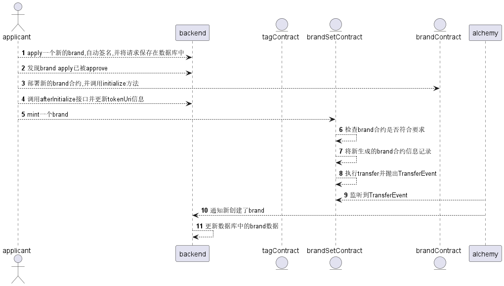
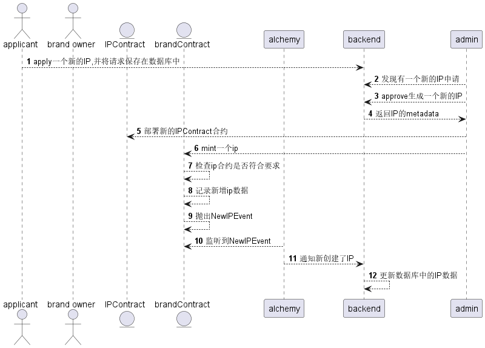
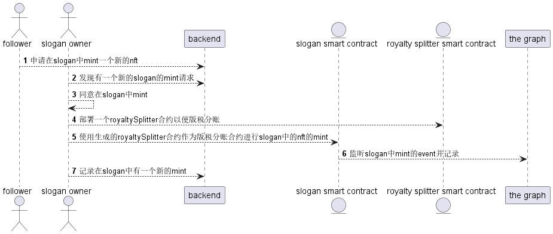

# Brand3Dao

## 整体介绍

此项目将用户所拥有的nft数据都保存在区块链上，用户数据和关联关系数据采用关系型数据库的方式保存。其中需要用到的链上数据都使用event进行抛出，并建立了the
graph以便进行查询。
> the graph address：待补充

[the graph介绍](https://thegraph.com/en/)

## 链上部分架构介绍

合约的整体架构如图所示  
其中最核心的3个合约分别为

* Brand3Tag
  > 一个NFT合约，其中每一个Tag都视为一个NFT，Tag最终会通过Slogan与User建立联系，以便标注User的偏好类型。
* Brand3Slogan
  > 一个普通的NFT合约，每当新建一个Slogan的时候都会部署一个新的合约，所以此合约会部署多个实例。  
  > 在合约中可以mint不同的内容作为NFT的内容。
* Brand3Factory
  > Slogan合约的工厂合约，通过此合约部署新增的Slogan合约。在此合约中会记录所有已部署的slogan合约。

## 如何新增Tag

## 如何新增Slogan

## 如何在slogan中新增内容

## 各合约的接口文档

[Brand3Slogan](./docs/Brand3SloganDoc.md)  
[Brand3Tag](./docs/Brand3TagDoc.md)  
[Brand3Factory](./docs/Brand3FactoryDoc.md)  
[RoyaltySplitter](./docs/RoyaltySplitterDoc.md)  
[WihteList](./docs/WhiteListDoc.md)  

