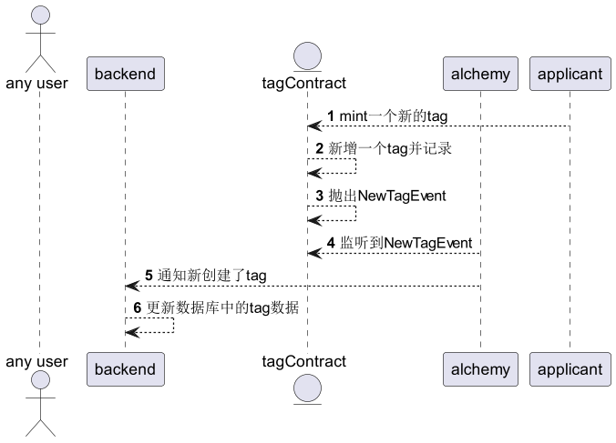
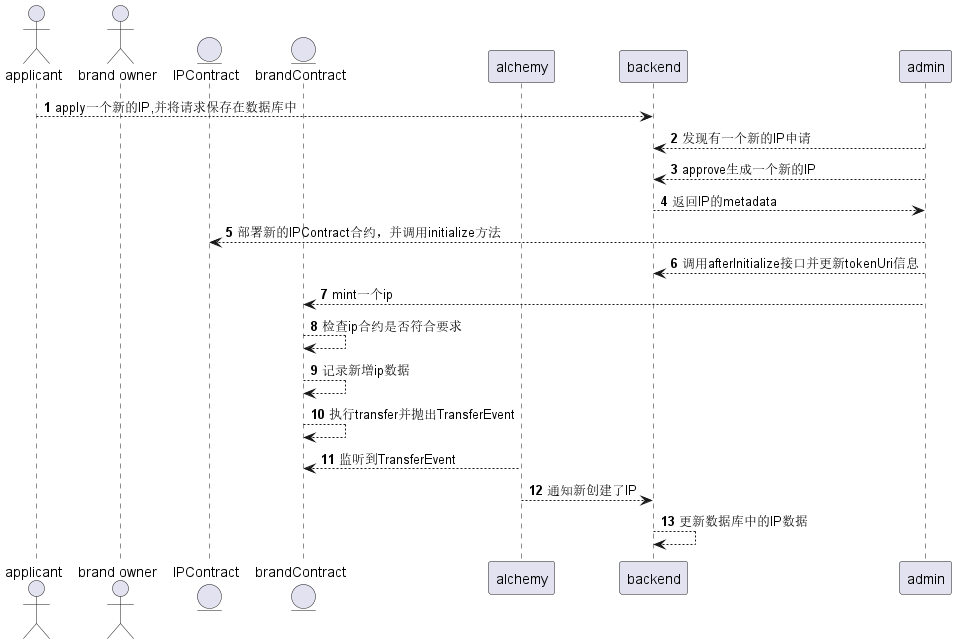

# Brand3Dao

## 如何新增Tag

## 如何新增Brand

## 如何新增IP

## 各合约的接口文档

[BrandContract](./docs/BrandContractDoc.md)  
[TagContract](./docs/TagContractDoc.md)  
[BrandFactoryContract](./docs/BrandFactoryContractDoc.md)   
[IPContract](./docs/IPContractDoc.md)   

